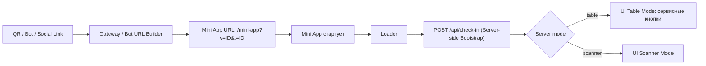

# Единый стандарт входа гостя (Guest Entry Flow)

Этот документ фиксирует целевую архитектуру входа гостя в Mini App по модели **Server-Side Truth**.

Главная идея: Mini App — это "телевизор" (тонкий UI), а сервер — единый центр принятия решений.

## 1) Цель и принципы

- Единый контракт входа для всех каналов (Telegram, WhatsApp, VK, Viber, Line, Instagram, Facebook, WeChat).
- Единая серверная точка истины: `POST /api/check-in`.
- Нулевая бизнес-логика на клиенте при старте Mini App.
- Предсказуемое поведение UI без мерцаний и рассинхрона.

## 2) Золотой поток (High-Level)

## 3) Единый контракт параметров

Единственный валидный формат ссылки входа:

`/mini-app?v=<venueId>&t=<tableId>`

Требования:

- Все генераторы ссылок обязаны формировать именно этот формат.
- Старые payload-форматы (например, `v:...:t:...`) допустимы только как промежуточный транспорт в боте.
- Если бот получает legacy-формат, он обязан конвертировать его в URL с query `?v=&t=` до открытия Mini App.
- Любые дополнительные query-параметры не должны менять логику входа и не являются источником истины.

## 4) Роль `/api/check-in`: единый мозг входа

`POST /api/check-in` — обязательная серверная bootstrap-точка на старте Mini App.

Endpoint отвечает за:

1. Валидацию входных параметров `venueId/tableId`.
2. Нормализацию ID стола:
   - приведение `05` и `5` к единому каноническому виду;
   - выбор канонического `tableId` до возврата ответа клиенту.
3. Проверку/создание/обновление активной сессии гостя.
4. Identity Merge (склейка идентичности):
   - при переходе из анонимного состояния в соц-идентичность (например, `anon:*` -> `tg:*`);
   - перенос роли master и участников на актуальный UID.
5. Возврат готового UI-режима:
   - `mode: "table"` -> гость за столом, показываем сервис;
   - `mode: "scanner"` -> сессия не подтверждена, показываем сканер.

Результат API должен быть самодостаточным для первого экранного решения клиента.

## 5) Правила Mini App (Client Rules)

На старте Mini App действует строгий протокол:

1. Прочитать `v/t` из URL.
2. Если `v/t` есть -> отправить один bootstrap-запрос в `/api/check-in`.
3. До ответа сервера показывать только `Loader`.
4. После ответа:
   - `mode=table` -> открыть режим стола (сервисные кнопки).
   - `mode=scanner` -> показать сканер.

Критичное ограничение:

- Mini App **не имеет права** самостоятельно принимать бизнес-решение "за столом / не за столом" при наличии `v/t`.
- Client не должен подменять серверное решение fallback-логикой.

## 6) Почему это устраняет рассинхрон

Ранее рассинхрон возникал из-за конкурирующих цепочек (бот/gateway/client bootstrap).
Теперь:

- все каналы приводят в один URL-контракт;
- единственная доменная точка решения — `/api/check-in`;
- UI только отображает готовый серверный verdict.

Это исключает ситуацию "в дашборде гость есть, а в Mini App нет кнопок" при корректных входных данных.

## 7) Требования для новых интеграций (будущие соцсети)

Любой новый канал обязан:

1. Доставить гостя в Mini App по ссылке `/mini-app?v=<venueId>&t=<tableId>`.
2. Не внедрять собственный check-in/claim/recover вне `/api/check-in`.
3. Не обходить server bootstrap прямым переключением UI.
4. Соблюдать единый контракт идентичности (server-side merge, если требуется).

## 8) Антипаттерны (запрещено)

- Создавать отдельные "фоновые" цепочки посадки в боте или gateway.
- Дублировать логику нормализации `tableId` на клиенте как источник истины.
- Показывать scanner/table-mode до server bootstrap ответа при наличии `v/t`.
- Вводить channel-specific bootstrap API вместо единого `/api/check-in`.

## 9) Краткий чек-лист приемки

- [ ] Любой входной URL для Mini App содержит `v` и `t`.
- [ ] Mini App при старте делает ровно один bootstrap-запрос к `/api/check-in`.
- [ ] До ответа виден только Loader.
- [ ] Server возвращает `mode` и канонический `tableId`.
- [ ] UI переключается только по `mode` из ответа сервера.
- [ ] Отсутствуют параллельные client/bot/gateway check-in сценарии.

